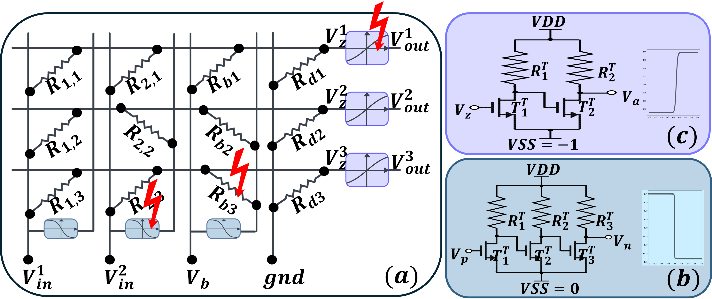

# Automatic Test Pattern Generation for Printed Neuromorphic Circuits

This repository contains the code, simulation scripts, and the accepted paper for our project on Automatic Test Pattern Generation (ATPG) for Printed Analog Neuromorphic Circuits (pNCs).



## Overview

Printed Electronics (PE) offers significant benefits—including flexibility, low-cost fabrication, and customization—but also introduces unique defect challenges due to additive manufacturing. This project proposes a novel ATPG framework that:

- **Reduces the fault space** by abstracting faults via clustering (grouping faults with similar transfer functions) and removing untestable faults.
- **Generates optimized test patterns** using a gradient-based optimization algorithm that maximizes discrepancies between fault-free and faulty circuit responses.
- **Achieves high fault coverage** (over 90% in our experiments) with fewer test vectors compared to a baseline Random Pattern approach.

## Repository Structure

- **ATPG.ipynb**: Jupyter Notebook with the implementation of the gradient-based ATPG method.
- **Analysis_ATPG.ipynb**: Notebook for simulation analysis and evaluation.
- **main_code/**: Directory containing ATPG-related functions and SPICE simulation scripts.
  - **FaultAnalysisDropout/**: Implementation of the Printed Neural Network and fault injection.
  - **clustering/**: Implementation for clustering the transfer functions for p-tanh and p-negative-weight circuits.

## Citation

If you use this work, please cite our paper as follows:

```bibtex
@inproceedings{gheshlaghi2025atpg,
  author    = {Gheshlaghi, Tara and Pal, Priyanjana and Studt, Alexander and Hefenbrock, Michael and Beigl, Michael and Tahoori, Mehdi B.},
  title     = {Automatic Test Pattern Generation for Printed Neuromorphic Circuits},
  booktitle = {Proceedings of the IEEE European Test Symposium (ETS)},
  year      = {2025},
  note      = {Accepted for publication},
  doi       = {},
}
```
